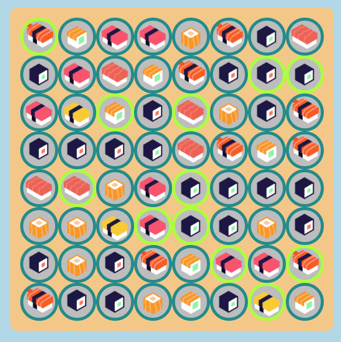
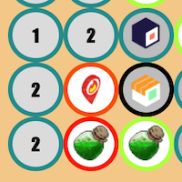
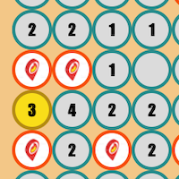
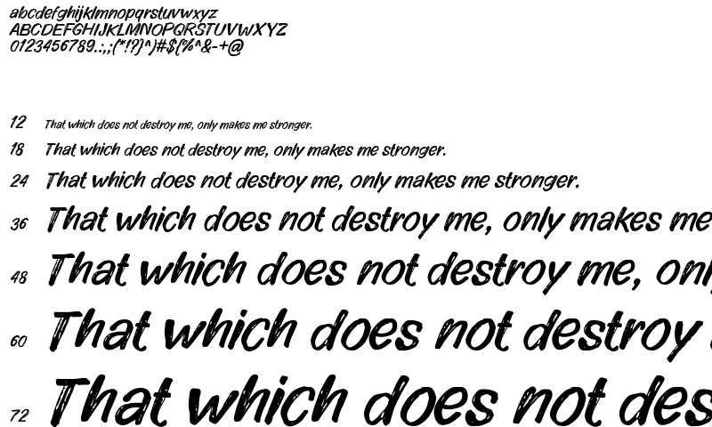
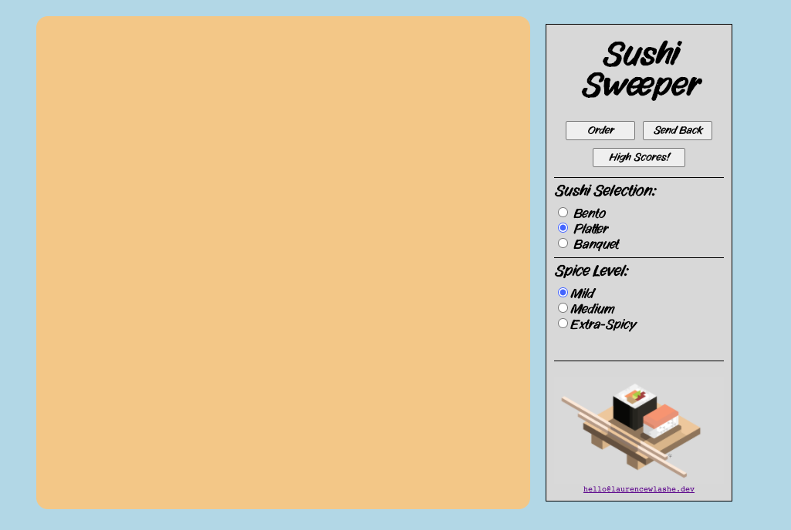

### General Assembly Software Engineering Immersive 
# Project 1 - Sushi Sweeper

		
	  _________            .__    .__    _________                                          
	 /   _____/__ __  _____|  |__ |__|  /   _____/_  _  __ ____   ____ ______   ___________ 
	 \_____  \|  |  \/  ___/  |  \|  |  \_____  \\ \/ \/ // __ \_/ __ \\____ \_/ __ \_  __ \
	 /        \  |  /\___ \|   Y  \  |  /        \\     /\  ___/\  ___/|  |_> >  ___/|  | \/
	/_______  /____//____  >___|  /__| /_______  / \/\_/  \___  >\___  >   __/ \___  >__|   
	        \/           \/     \/             \/             \/     \/|__|        \/       


## The Overview
This project is the first fully developed task - set as part of the Software Engineering Immersive Course from General Assembly.  

The task was to choose from a set of grid based games that could utilise array based logic, moving parts and variable difficulty settings.  

I took to Minesweeper to challenge my knowledge of recursive logic and functions.

You can play my game here: ***[Sushi Sweeper 🍣](https://prodigresser.github.io/project-1/)***

### What is Minesweeper? (Sushi Sweeper)
Minesweeper is a classic Windows PC game. The idea is to decide which tile mines are hidden under based on numbered clues hidden under the remaining tiles -

- If the player clicks on a tile that a mine is under the game is immediately over and the board is cleared to reveal the location of all the mines.
- If the player manages to work out where all the mines are located without actually clicking on them, then they clear the board and receive a score.

### The Brief

- Render a game in the browser
- Design logic for winning & losing
- Include separate HTML / CSS / JavaScript files
- Stick with KISS (Keep It Simple Stupid) and DRY (Don't Repeat Yourself) principles
- Use Javascript for DOM manipulation
- Deploy your game online, where the rest of the world can access it
- Use best practices when developing in HTML (semantic tags etc.)

### Technologies Used

- HTML5 & CSS3
- JavaScript (ES6)
- Git & GitHub
- Font Resources (Font Space)

## The Game
In order to develop this game I identified a few core pieces of logic that would important to making this game playable - 

1. To generate and populate the board with 'mines'
  - Set a board size
  - Set mines to unique cells (no repeats)
2. Use logic to define the game boundaries
  - Ensure that the logic is scalable to different board sizes
  - Use the logic to define the corners and edges of the board
3. To check adjacent cells when a cell without a mine is selected
  - Ensure only valid cells are checked
  - Use boundary logic to execute
4. To for an adjacent checker to run recursively if it detects more safe cells
  - Create logic to prevent the algorithm to run perpetually
  - Ensure the checker runs accurately, and does not select mine cells in the process 


### The Grid
The game is played around a grid with randomly assigned 'mine' components. It was important to design this with allowances to change board size easily and adjust levels of difficulty.

This block of code receives a variable of 'width' and uses it in conjunction with a for loop to make an array of cells while pushing each cell to the 'grid' component. 

For ease of navigation, debugging and legibility in functions that select these cells further down the line - i also assign an id of the cells index to each cell.

```javascript 
	  for (let i = 0; i < width ** 2; i++) {
	    const div = document.createElement('div')
	    div.classList.add('cell')
	    if (width === 8) {
	      div.classList.add('game-small')
	    } else if (width === 12) {
	      div.classList.add('game-medium')
	    } else {
	      div.classList.add('game-large')
	    }
	    div.id = i
	    grid.appendChild(div)
	    cellArray.push(div)
	  }
```

This block of code is a random number generator that creates an array of cells with unique random numbers up to the final index of the cellArray. This random number array is looped through the cell array where the random number value finds the index of a given cell and plants the 'bomb' class -


```Javascript
	  for (let i = 0; i < (cellArray.length / gameDifficulty) + 1; i++) {
	    const rng = Math.floor(Math.random() * cellArray.length)
	    if (rngArray.includes(rng)) {
	      i--
	    } else {
	      rngArray.push(rng)
	    }
	    mineCounter = rngArray.length
	    minesDiv.innerHTML = mineCounter
	  }
	
	  for (let i = 0; i < rngArray.length; i++) {
	    cellArray[rngArray[i]].classList.add('bomb')
	  }
```
Here you see the randomly assigned cells highlighted in a different colour border:  




#### The Boundaries & Adjacent Cells
  
For a game of this type to function properly the boundaries need to be clearly set. If these parameters are not set properly then functions and selectors are prone to wrap around the grid, select the wrong element or not function as intended.

I found that many of the calculations were similar when checking for local mines could be assigned at the beginning of the game. This made for much more legible and scalable code down the line. 

Examples include this block of code which assigned variables to the corner boundaries of the grid -

```javascript
        const boundTopLeft = 0
        const boundTopRight = width - 1
        const boundBottomRight = (width ** 2) - 1
        const boundBottomLeft = width ** 2 - width
```

As with boundaries - the adjacent cells are consistently calculable and so assigning them each time a cell is selected is incredibly important when it comes to recursion.

This block of code automatically finds adjacent cells based on the 'id' of the selected for each time a cell is selected -

```javascript
        const idLeft = Number(cell.id) - 1
        const idTopLeft = Number(cell.id) - width - 1
        const idTop = Number(cell.id) - width
        const idTopRight = Number(cell.id) - width + 1
        const idRight = Number(cell.id) + 1
        const idBottomRight = Number(cell.id) + width + 1
        const idBottom = Number(cell.id) + width
        const idBottomLeft = Number(cell.id) + width - 1
```

And here is an example of a function that checks an adjacent cell, and logs the bomb count if one is detected -

```javascript
        function bottomLeft() {
          if (cellBottomLeft.classList.contains('bomb')) {
            bombCount += 1
          }
        }
```

### Recursion

Recursion is, in my opinion, the heart of a game of Minesweeper. And so creating a robust algorithm was key to the success of the game.

The flow of the algorithm is like so:-

1. Identify the cell as having been checked and check for mines near the selected cell.
  - If there is a local mine, go to 2.
  - If there are no local mines, select each unchecked adjacent cell and go to 1.
2. Add number of mines to the cell and stop.

At the beginning of each run of the algorithm the function selects the local cells in case they are called later - 

```javascript 
      const cellTop = document.getElementById(idTop)
      const cellTopLeft = document.getElementById(idTopLeft)
      const cellLeft = document.getElementById(idLeft)
      const cellBottomLeft = document.getElementById(idBottomLeft)
      const cellBottom = document.getElementById(idBottom)
      const cellBottomRight = document.getElementById(idBottomRight)
      const cellRight = document.getElementById(idRight)
      const cellTopRight = document.getElementById(idTopRight)
```

Here is what the algorithm would run if the selected cell is on the top edge - 

```javascript
// ? If the cell is on the TOP EDGE
     if (Number(cell.id) < width) {
// * Use THESE functions to check for mines >, V>, V, V<, and < 
       right(); bottomRight(); bottom(); bottomLeft(); left()
// ? If the functions find one or more mines
       if (bombCount !== null) {
// * Add the number of mines
         cell.innerHTML = bombCount
// ? If NO mines were found
       } else {
// * Check these cells for mines (If they have not yet been checked)
         if (!cellBottom.classList.contains('safe')) { mineCheck(cellBottom) }
         if (!cellBottomRight.classList.contains('safe')) { mineCheck(cellBottomRight) }
         if (!cellBottomLeft.classList.contains('safe')) { mineCheck(cellBottomLeft) }
         if (!cellLeft.classList.contains('safe')) { mineCheck(cellLeft) }
         if (!cellRight.classList.contains('safe')) { mineCheck(cellRight) }
     }
```

## Additional Components
### Flagging the board
Along with revealing the board through clicks - another core part of the game includes the use of flagging dangerous cells to 'disarm' them. 

Through the use of the eventListener 'contextmenu' on the array of cells I repurposed the right click to become the flag selector, instead of opening up the 'right click' menu. 

This code block shows what happens when a right click occurs - 

```javascript
cell.addEventListener('contextmenu', (e) => {
      e.preventDefault()
      if (!cell.classList.contains('safe')) {
        if (cell.classList.contains('flag')) {
          mineCounter += 1
          cell.classList.remove('flag')
        } else {
          cell.classList.add('flag')
          mineCounter -= 1
        }
        minesDiv.innerHTML = mineCounter
      }
```

### UI and Color Coding
In order to convey information on the screen in a compelling way - I chose bright or high contrast colours for important information and pastels or greys for less important details.




For fonts i used Impact for the game and Vabulous for the menu. Impact is a common font, thick and easy to read. 

Vabulous on the other hand has a Japanese paintbrush effect to be more in keeping with the aesthetic. Here is a font sample - 



### The Game 'Menu'
In keeping with the chosen theme and style of game I think a minimal 'takeaway menu' fit really well into the game. Here we have radio switches that inform the game parameters, two buttons to set and reset the game board and a 'High Score' button to show off scores form the Local Storage.

Adjusting the menu to reveal the game details works well for the game too -  including a timer, game score and the number of unflagged mines.

## In Conclusion
### Future Features

1. Fix scoreboard to display 'Top 3'
2. Add responsive features to screen sizes, including a landscape menu.
3. Add mobile functionality, including flag placing
4. Add remote storage for High Scores
5. Add music and sound effects

### Lessons and More

This project was a big learning experience, with it built from the ground up. I have gained a greater understanding for the method for building a responsive web application. I have also gained a better understanding of debugging code in its various forms - from the Console to the Rubber Duck!

For the future I intend to work more in a methodical way when it comes to formatting and developing my code taking extra care to execute the control and flow of my code.

Thats all folks! Enjoy the game.

### Fixes and Adjustments 
- Fixed scoreboard to remove null value names
- Scoreboard only shows top 3 scores
- Difficulty balance adjustment

Link --> [🍙](https://prodigresser.github.io/project-1/)

]
